# 블로그 렌더링 아키텍처 정리

`force-dynamic` 제거부터 Server Action까지, 논의한 내용을 작은 단위로 쪼개서 정리한 문서입니다.

---

## 1. 문제였던 부분: `force-dynamic`

`export const dynamic = "force-dynamic"`이 있으면 **요청이 올 때마다** 페이지가 처음부터 다시 렌더링됩니다.

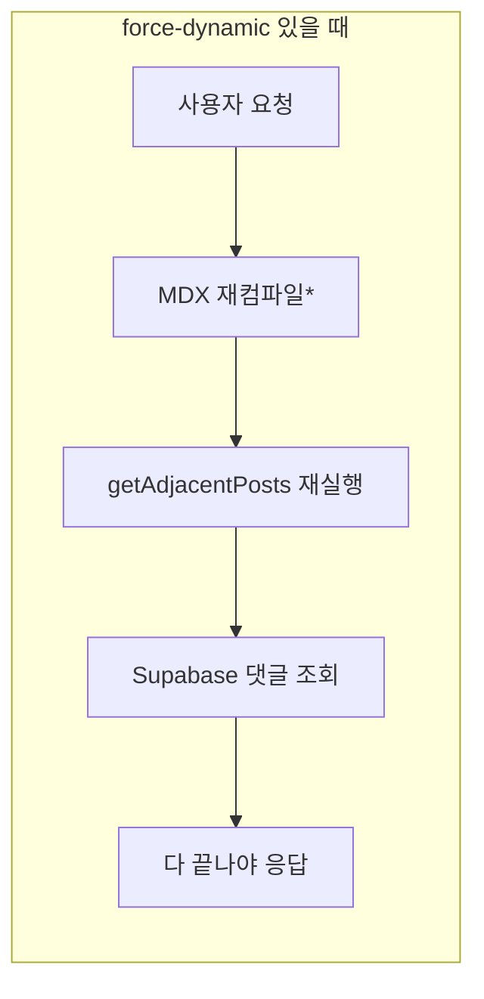

*실제로는 "재컴파일"이 아니라 "이미 컴파일된 모듈을 다시 import"인데, 이 부분은 9번에서 따로 다룸.

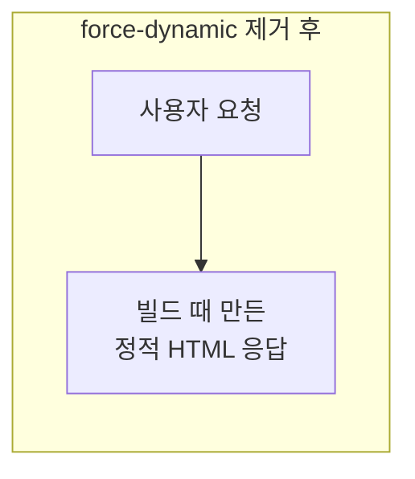

**원래 이걸 넣은 이유**: 댓글이 새로고침해도 안 보이는 문제를 페이지 전체를 동적으로 돌려서 억지로 해결한 것 (git blame상 댓글 기능과 같은 커밋에서 추가됨). → 부작용으로 본문/이전글다음글까지 매번 재실행되어 느려짐.

---

## 2. 라우트 세그먼트 설정 옵션

| 옵션 | 역할 |
|---|---|
| `generateStaticParams` | "이 슬러그들만큼 정적 페이지를 만들어라"고 Next에 알려줌 |
| `dynamicParams = false` | 목록에 없는 슬러그 접근 시 즉시 404 (요청 시점 렌더링 시도 안 함) |
| ~~`dynamic = "force-dynamic"`~~ | (제거됨) 매 요청마다 동적 렌더링 강제 |

---

## 3. 빌드 타임: 정적 페이지가 만들어지는 순서

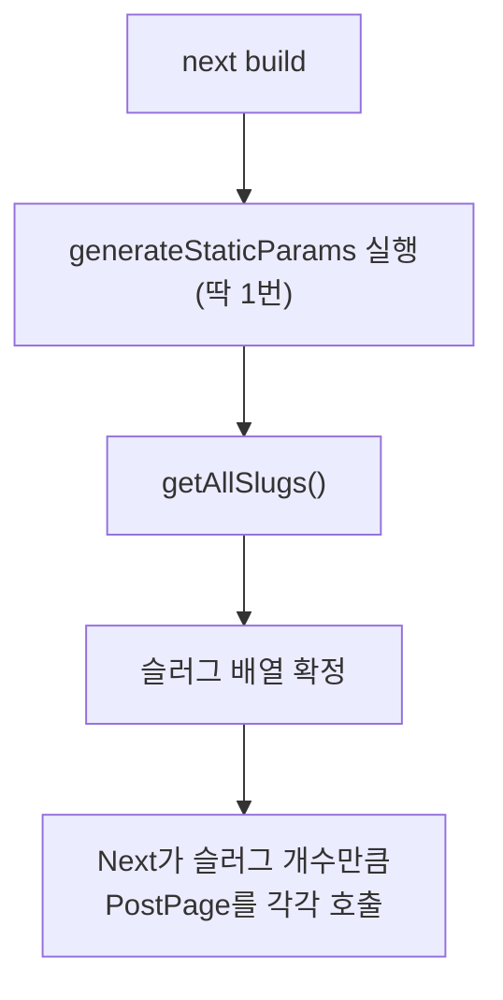

- `PostPage`는 "청사진"이고, `generateStaticParams`가 준 슬러그 배열의 개수만큼 **서로 독립적으로 호출**됨
- 각 호출은 자기가 받은 슬러그 하나만 가지고 동작 (다른 슬러그와 무관)

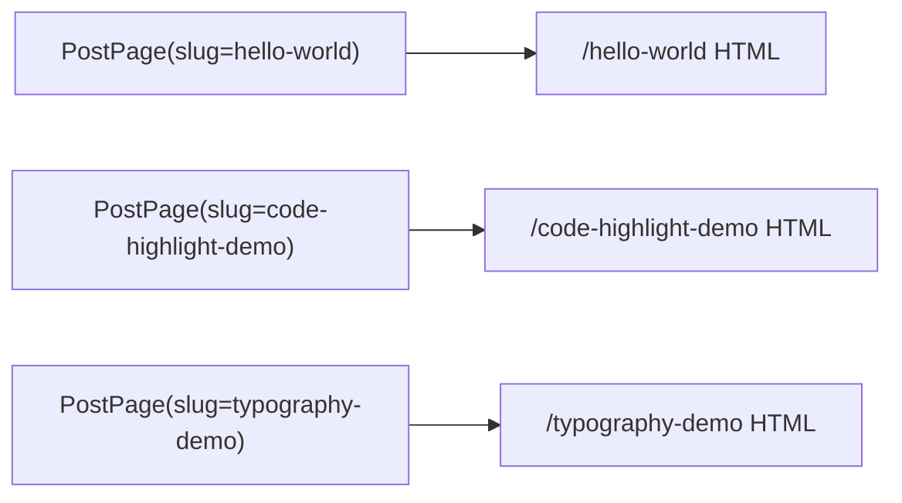

---

## 4. `posts.ts` 함수들의 관계

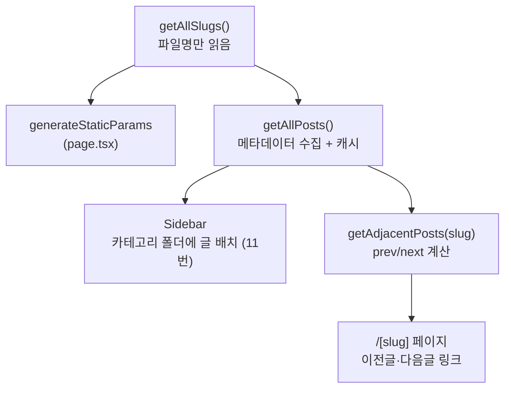

| 함수 | 반환하는 것 | 못 하는 것 |
|---|---|---|
| `getAllSlugs` | 파일명(slug) 배열 | 제목/태그 정보 없음 |
| `getAllPosts` | slug + title + date + excerpt + tags + category | 본문(Post 컴포넌트) 안 씀 |
| `getAdjacentPosts` | 현재 글의 prev/next | 목록 전체 정렬은 `getAllPosts`에 위임 |

---

## 5. `getAllPosts` 캐싱 (`unstable_cache`)

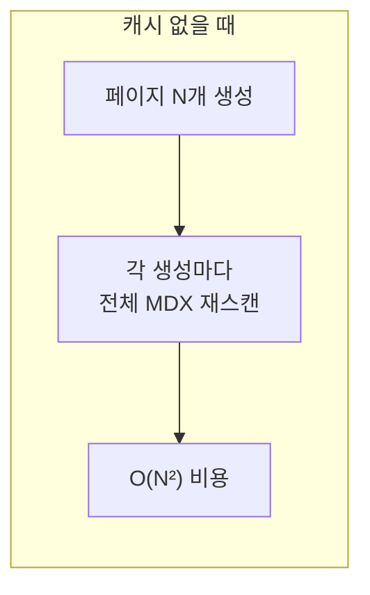

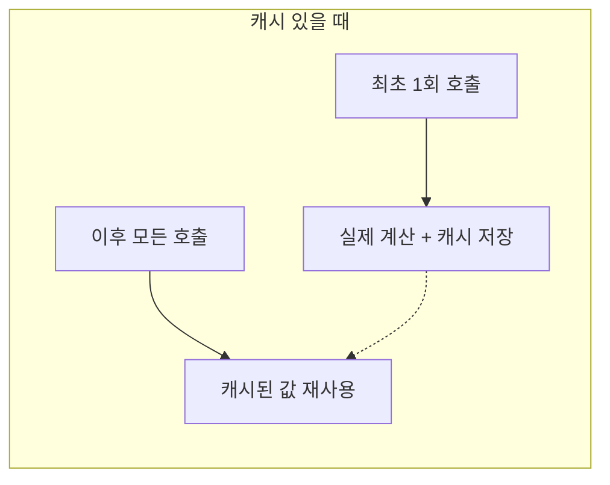

- 캐시 키: `["all-posts"]`, 태그: `["posts"]`
- `revalidate` 생략 → 무기한 캐싱, `revalidateTag("posts")` 호출 전까지 유지

---

## 6. 라우트 세그먼트 트리 (레이아웃 vs 페이지)

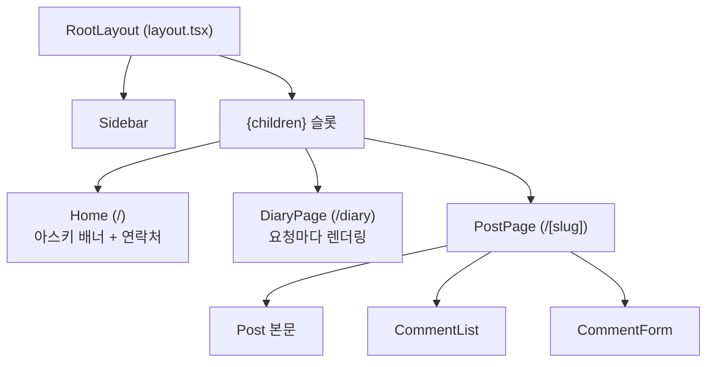

- `Sidebar`는 `RootLayout`이 직접 렌더링하는 형제 컴포넌트, `{children}`(페이지)엔 props를 못 꽂음
- 동적 API(`cookies()`, `headers()` 등)를 아무도 안 쓰기 때문에 이 트리 전체가 **빌드 타임에 정적으로 굳음**
- 예외: `/diary`는 `?page=`(searchParams)와 세션(`isAdmin()`)을 읽어서 요청마다 렌더링된다 ([`diary-architecture.md`](./diary-architecture.md)). `/admin`도 동적. 정적 경로라 `/[slug]`보다 먼저 매칭되므로 slug가 `diary`인 글은 만들 수 없다.

---

## 7. 댓글 등록 시퀀스

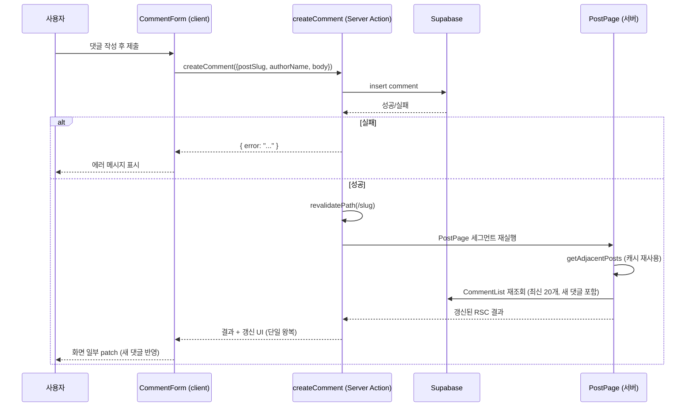

---

## 8. `revalidatePath`의 영향 범위 판단법

**규칙**: `path`(+`type`)가 가리키는 **파일 하나**가 다시 실행되고, 그 파일이 JSX로 렌더링하는 모든 것(중첩 포함)이 같이 실행됨. 위(부모 레이아웃)나 옆(다른 라우트)으로는 안 퍼짐.

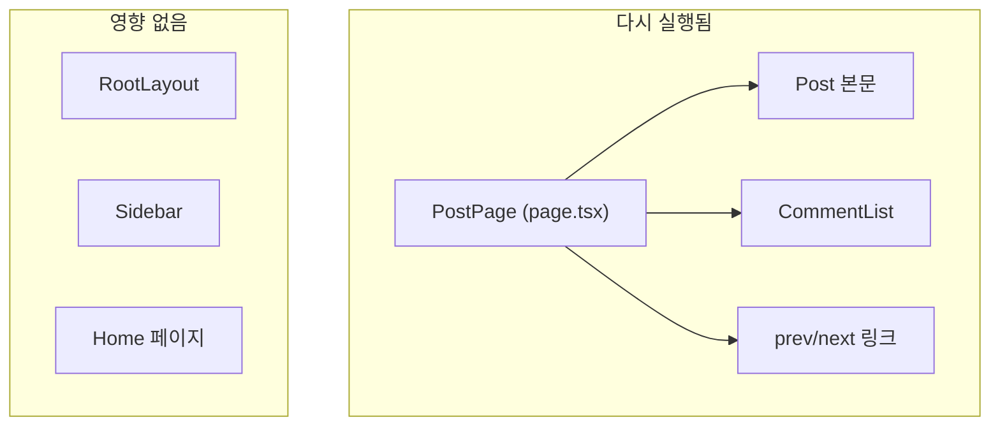

| 호출 | 무효화 범위 |
|---|---|
| `revalidatePath('/hello-world')` | 그 페이지 하나만 |
| `revalidatePath('/[slug]', 'page')` | 패턴에 맞는 모든 페이지 |
| `revalidatePath('/[slug]', 'layout')` | 그 세그먼트의 layout + 하위 전부 |

---

## 9. MDX "컴파일 시점" vs "import 시점"

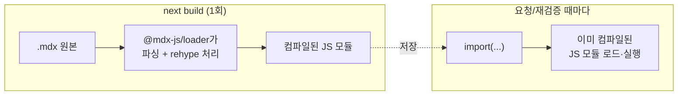

- 댓글 등록 → 재검증이 일어나도 **마크다운을 다시 파싱하지 않음** (이미 끝난 작업)
- 글이 아주 크면, 파싱 비용이 아니라 **큰 React 트리를 다시 렌더링하는 비용**만 존재

---

## 10. 검토했던 최적화 아이디어와 결론

| 아이디어 | 채택 | 이유 |
|---|---|---|
| `getAllPosts`에 `unstable_cache` 적용 | ✅ | 빌드 시 O(N²) → O(N)으로, 실질적 효과 있음 |
| Server Action + `revalidatePath`로 댓글 처리 | ✅ | 정적 렌더링 유지하면서 댓글만 최신화 |
| `getAllSlugs`도 추가 캐싱 | ❌ | 이미 충분히 저렴한 연산 (fs.readdirSync 1회) |
| 카테고리를 폴더 구조로 관리 | ❌ (보류) | 성능과 무관, 콘텐츠 구조 취향의 문제 |
| 카테고리를 DB(Supabase `categories`)로 관리 + `/admin` 관리 페이지 | ✅ | 중첩 폴더 지원, 이름 변경·이동 시 MDX 수정 불필요 (11번, [`category-admin-plan.md`](./category-admin-plan.md)) |
| 카테고리를 `const`로 하드코딩 | ❌ | 글 추가 때마다 수동 동기화 필요 → 유지보수 부담 |
| prev/next를 링크드리스트로 관리 | ❌ | 글 순서 바뀔 때마다 수동으로 체인 재연결 필요, 지금 정렬 방식이 이미 충분히 저렴 |
| 댓글 섹션 전체를 CSR로 전환 | ❌ | 정적 페이지의 초기 렌더링(SEO 포함) 이점을 잃음, 이미 단일 왕복으로 충분히 빠름 |
| (대안) `useOptimistic`으로 내 댓글만 즉시 반영 | ❌ (폐기) | 검토 후 계획에서 제외 (2026-09-18) |

---

## 11. 카테고리 데이터 흐름

사이드바 폴더와 글 상세의 카테고리 경로는 Supabase `categories` 테이블에서 온다. 결정 사항과 작업 내역은 [`category-admin-plan.md`](./category-admin-plan.md), 어드민 로그인 구조는 [`auth-architecture.md`](./auth-architecture.md) 참고.

### 글과 폴더를 잇는 방법

- MDX `metadata.category`에는 **글이 바로 속한 폴더의 slug 하나만** 적는다 (`category: "react"`). 안 적으면 `null`.
- 상위 경로(`dev / frontend / react`)는 DB의 `parent_id`를 따라 올라가며 계산한다 → 폴더 이름 변경·이동 시 MDX는 그대로.
- slug는 만든 뒤 수정 불가 (바꾸면 연결된 글이 끊기므로). 화면에 보이는 건 `name`.
- 카테고리를 안 적었거나, DB에 없는 slug(삭제된 폴더·오타)를 적은 글은 **uncategorized** — 사이드바 최상위에 파일로, 메타 줄에는 카테고리 없이 표시.

### 읽기

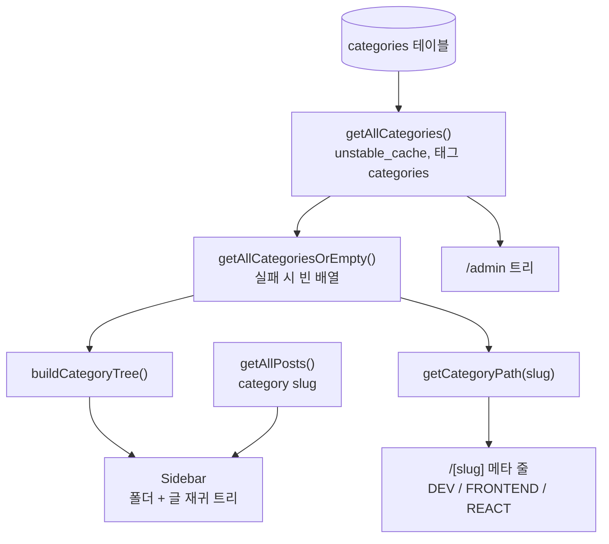

| 함수 (`src/lib/categories.ts`) | 역할 |
|---|---|
| `getAllCategories` | 전체 조회 (anon 클라이언트, 읽기 공개). 태그 `categories`로 캐시, 실패하면 예외 → 캐시 안 됨 |
| `getAllCategoriesOrEmpty` | 사이드바·글 페이지용. 조회 실패 시 로그만 남기고 빈 배열 → 모든 글이 uncategorized로 보일 뿐 페이지는 안 깨짐 |
| `buildCategoryTree` | 평평한 배열 → 트리 (`depth` 최상위 1, 같은 부모 안은 `sort_order` → `name`). 순환에 걸린 폴더는 최상위에 닿지 않아 빠짐 |
| `getCategoryPath` | 글의 slug → 최상위부터의 경로. 없는 slug·순환이면 빈 배열 |

- 사이드바는 루트 레이아웃에 있으므로 카테고리 조회도 **빌드 타임에 정적으로** 굳는다 (블로그 페이지는 여전히 정적).
- 같은 단계에서는 폴더 먼저, 글 나중. 글이 없는 빈 폴더도 표시한다.

### 쓰기 (`/admin`)

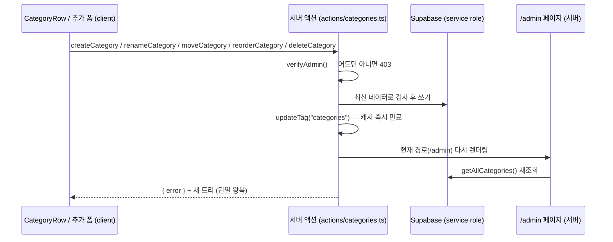

- 모든 쓰기 액션은 맨 앞에서 `verifyAdmin()`, 쓰기는 `supabaseAdmin`(service role)으로만.
- 깊이(최대 3단계)·순환 검사는 캐시가 아니라 **DB 최신 상태**로 한다. 자기 자신을 부모로 두는 것만 DB check 제약, 하위 폴더가 있는 폴더 삭제는 `on delete restrict`가 마지막 안전장치.
- `updateTag`를 서버 액션에서 호출하면 현재 경로가 같은 응답 안에서 다시 렌더링된다. `revalidateTag(tag, "max")`는 다시 렌더링하지 않아서(stale-while-revalidate) 어드민에는 쓰지 않는다.
- 이미 만들어진 다른 페이지(글 상세 등)는 미리 다시 만들지 않고, **다음 방문 때** 새 카테고리 데이터로 다시 만들어진다.
- 실패 원인은 화면에 그대로 보여주지 않고 `console.error("[액션 이름] …")`로 서버 로그에 남긴다.
