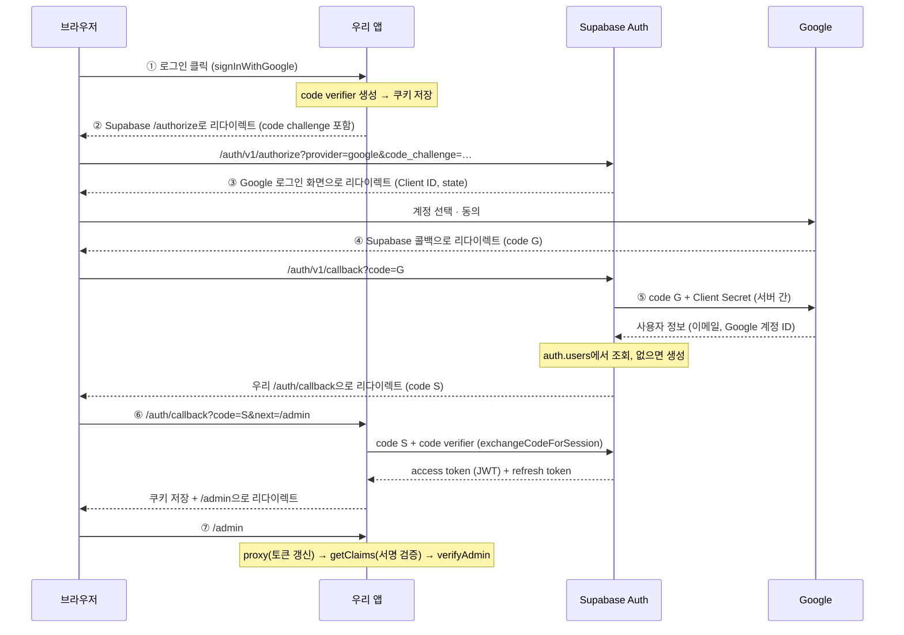

# 어드민 인증 아키텍처

`/admin` 관리 페이지의 Google OAuth 로그인과 어드민 판별(403) 구조를 정리한 문서입니다. 어드민은 블로그 주인 한 명뿐이고, 관리 페이지는 UI 어디에도 링크가 없어 URL로 직접 들어가야 하지만 **URL을 숨기는 것만으로는 보안이 되지 않으므로** 실제 인증·인가를 거치도록 설계했습니다.

---

## 1. 등장인물 — OAuth가 두 번 겹쳐 있다

| 역할 | 누구 |
|---|---|
| 브라우저 | 사용자 |
| 우리 앱 | Next.js 블로그 (`/admin`, `/auth/callback`) |
| Supabase Auth | 로그인을 대신 처리해 주는 인증 서버 |
| Google | 실제로 "이 사람이 누구인지" 확인해 주는 곳 |

- **Google ↔ Supabase**: Supabase가 Google에 "이 사용자 확인해줘"라고 요청하는 구간. Google Cloud Console에서 만든 Client ID/Secret이 여기서 쓰인다.
- **Supabase ↔ 우리 앱**: 우리 앱이 Supabase에 "로그인 결과를 줘"라고 요청하는 구간.

**우리 앱은 Google과 직접 통신하지 않고, Google 토큰도 받지 않는다.** 우리 앱이 받는 건 Supabase가 발급한 토큰뿐이다.

---

## 2. 전체 흐름

### ① 로그인 버튼 클릭 — `src/lib/actions/auth.ts` `signInWithGoogle`

- 버튼이 `<form action={signInWithGoogle}>` 안에 있어서 누르면 서버 액션이 실행된다.
- `signInWithOAuth`가 **code verifier**(무작위 문자열)를 만들어 **쿠키에 저장**한다 (`createSessionClient`의 `setAll`이 씀).
- verifier를 해시한 **code challenge**를 붙여 Supabase 로그인 주소를 만든다.
- `redirectTo`는 `요청 origin + /auth/callback?next=/admin`. origin을 요청에서 읽기 때문에 localhost와 배포 도메인 모두 코드 수정 없이 동작한다.

### ② Supabase로 이동

- `redirect(data.url)`로 브라우저를 `https://<project-ref>.supabase.co/auth/v1/authorize?...`로 보낸다.
- Supabase는 challenge와 redirectTo를 기억해 둔다.

### ③ Google로 이동

- Supabase가 **Client ID**를 붙여 Google 로그인 화면으로 보낸다.
- CSRF 방지용 `state` 값도 함께 보내며, 검증은 Supabase가 알아서 한다.

### ④ Google 로그인

- 사용자가 계정을 고르고 동의한다.
- OAuth 동의 화면이 "테스트" 상태라 **테스트 사용자로 등록된 계정만** 이 단계를 통과한다.
- Google은 **1회용 코드 G**를 붙여, Google Cloud Console에 등록된 **승인된 리디렉션 URI**(= Supabase 콜백)로만 돌려보낸다.

### ⑤ Supabase ↔ Google 서버 간 통신

- 코드 G + **Client Secret**을 Google에 보내 사용자 정보를 받는다. Secret은 이 구간에서만 쓰이고 브라우저에 절대 노출되지 않는다.
- `auth.users`에서 사용자를 찾고, **처음 로그인한 사람이면 여기서 계정을 새로 만든다.** 이때 붙는 uuid가 `ADMIN_USER_ID`에 넣는 값이다. "Allow new users to sign up"을 끄면 바로 이 단계에서 거절된다.
- **Supabase가 발급한 별도의 1회용 코드 S**를 붙여 `redirectTo`로 보낸다. 이때 그 주소가 Supabase **Redirect URLs 허용 목록**에 있는지 확인한다.

### ⑥ 코드 → 세션 교환 — `src/app/auth/callback/route.ts`

- `exchangeCodeForSession(code)`가 **코드 S** + ①에서 쿠키에 저장한 **verifier**를 Supabase에 보낸다.
- Supabase는 `hash(verifier) == challenge`인지 확인하고 토큰 두 개를 발급한다.
  - **access token**: JWT. 사용자 uuid(`sub`)와 이메일이 들어 있고 약 1시간 유효.
  - **refresh token**: access token 만료 시 새로 받는 데 쓴다.
- `setAll`이 두 토큰을 `sb-<project-ref>-auth-token` 쿠키에 저장하고 `next`(`/admin`)로 보낸다.
- `next`는 `/`로 시작하고 `//`로 시작하지 않을 때만 따른다 (open redirect 방지 — `//evil.com`은 브라우저가 다른 도메인으로 해석한다).
- 코드가 없거나 교환에 실패하면 `/admin?error=callback`으로 보낸다.

### ⑦ 로그인 이후 요청마다

- `src/proxy.ts`: access token이 만료됐으면 refresh token으로 새로 받아 쿠키를 교체한다 → 1시간이 지나도 로그인이 풀리지 않는다.
- `getCurrentUser()` (`src/lib/dal.ts`): `getClaims()`가 JWT **서명을 검증**한 뒤 claims를 꺼낸다. 쿠키를 조작하면 서명이 맞지 않아 통과하지 못한다.
- `verifyAdmin()` (`src/lib/dal.ts`): `claims.sub`와 `ADMIN_USER_ID`를 비교한다.

### 로그아웃 — `signOut()`

Supabase에서 refresh token을 폐기하고 세션 쿠키를 지운 뒤 `/admin`으로 보낸다.

---

## 3. 인증(authentication) vs 인가(authorization)

| | 질문 | 담당 | 실패 시 |
|---|---|---|---|
| 인증 | 이 사람이 누구인가? | ①~⑥ OAuth 흐름, `getCurrentUser()` | 로그인 버튼 표시 |
| 인가 | 이 사람에게 권한이 있는가? | ⑦ `verifyAdmin()` | `forbidden()` → 403 |

Google 계정만 있으면 누구나 인증까지는 통과할 수 있다(동의 화면 테스트 사용자 제한을 풀었다면). 403은 인가 단계에서 나온다.

`/admin` 페이지의 분기:

| 상태 | 화면 |
|---|---|
| 로그인 안 함 | "Google로 로그인" 버튼 (403을 보여주면 어드민 본인도 로그인할 방법이 없으므로) |
| 로그인했지만 어드민 아님 | `forbidden()` → `src/app/forbidden.tsx` (403, 로그아웃 버튼 포함) |
| 어드민 | 관리 화면 |

---

## 4. 파일 구성

| 파일 | 역할 |
|---|---|
| `src/lib/supabase/session-client.ts` | `createSessionClient()` — 로그인 세션 쿠키를 읽고 쓰는 클라이언트. 요청마다 쿠키가 다르므로 매번 새로 만든다. 서버 컴포넌트 렌더링 중엔 쿠키를 쓸 수 없어 `setAll`을 `try/catch`로 감쌈 |
| `src/proxy.ts` | `/admin` · `/diary` 요청 직전 세션 토큰 갱신. 403 판단은 하지 않음 |
| `src/lib/actions/auth.ts` | `signInWithGoogle` / `signOut` 서버 액션 |
| `src/app/auth/callback/route.ts` | 코드 S → 세션 교환, open redirect 방지 |
| `src/lib/dal.ts` | `getCurrentUser()` / `verifyAdmin()` / `isAdmin()` — 로그인·어드민 판단을 한 곳에 모은 Data Access Layer. 판별 규칙은 `isAdminUser()` 하나 (`verifyAdmin`은 아니면 403, `isAdmin`은 true/false만 — 공개 페이지에서 어드민 전용 UI를 보여줄지 정할 때) |
| `src/app/admin/page.tsx` | 로그인/403/관리 화면 분기 |
| `src/app/forbidden.tsx` | 403 화면 |
| `next.config.ts` | `experimental.authInterrupts: true` (`forbidden()` 사용에 필요) |

### Supabase 클라이언트 용도 정리

| 클라이언트 | 키 | 용도 |
|---|---|---|
| `client.ts` `supabase` | publishable(anon) | 공개 데이터 읽기 (댓글 목록 등) |
| `server-client.ts` `supabaseAdmin` | service role (RLS 우회) | 신뢰된 서버 쓰기 (댓글 등록, 카테고리 · 짧은 일기 CUD — `verifyAdmin()` 통과 후) |
| `session-client.ts` `createSessionClient()` | publishable + 세션 쿠키 | 로그인/로그아웃, 현재 사용자 확인 |

카테고리 쓰기를 `session-client`(authenticated 역할)가 아니라 service role로 하는 이유: `authenticated`에 쓰기 grant를 주면 Google 로그인만 하면 누구나 REST API로 직접 쓸 수 있게 되기 때문. 어드민 판별은 서버 코드(`verifyAdmin()`) 한 곳에서만 한다.

---

## 5. 설계 결정

- **proxy는 세션을 읽는 경로(`/admin`, `/diary`)에서만 실행**: Supabase 가이드는 모든 경로에서 실행하라고 하지만, 블로그 글 페이지는 로그인과 무관한 정적 페이지라 불필요한 인증 확인이 붙지 않도록 범위를 좁혔다. `/auth/callback`은 라우트 핸들러가 직접 쿠키를 쓸 수 있어 proxy가 필요 없다.
  - **세션을 읽는 페이지를 새로 만들면 matcher에도 반드시 추가한다.** 서버 컴포넌트는 쿠키를 쓸 수 없어서, 만료된 access token을 `getClaims()`가 갱신만 하고 저장하지 못한다 → 이미 쓴 refresh token이 다음 요청에서 재사용되고, Supabase가 재사용으로 판단하면 세션이 끊겨 로그인이 풀린다. `/diary`는 공개 페이지지만 `isAdmin()`으로 세션을 읽어서 추가했다(2026-10-04).
- **proxy는 보조 수단**: Next.js 문서 권장대로 proxy는 토큰 갱신만 하고, 실제 인가는 데이터에 가까운 `verifyAdmin()`에서 한다. 서버 액션은 페이지를 거치지 않고 직접 호출될 수 있으므로 **쓰기 액션마다 맨 앞에서 `verifyAdmin()`을 호출**한다.
- **브라우저용 Supabase 클라이언트 없음**: 로그인 시작·로그아웃을 서버 액션으로 처리하므로 필요 없다.
- **어드민 판별은 이메일이 아니라 uuid**: 이메일은 바뀔 수 있지만 Supabase uuid는 계정 생성 시 정해져 바뀌지 않고, 나중에 같은 이메일로 다른 로그인 방식을 추가해도 헷갈리지 않는다.
- **`ADMIN_USER_ID`가 비어 있으면 아무도 통과 못 함**: 배포 시 env 설정을 빠뜨려도 관리 페이지가 열리지 않는다 (fail closed).
- **`getClaims()`로 사용자 확인**: 쿠키의 JWT를 디코딩만 하는 `getSession()`과 달리 서명을 검증한다.

---

## 6. 왜 이렇게 되어 있나 (FAQ)

**Q. 왜 코드를 두 번 받나? (G와 S)**
구간이 두 개라서. 코드 G는 Google → Supabase, 코드 S는 Supabase → 우리 앱. 우리 앱은 코드 G를 보지도 않는다.

**Q. verifier / challenge는 왜 필요한가? (PKCE)**
코드 S는 URL에 붙어 전달되므로 브라우저 기록이나 로그에 남을 수 있다. PKCE를 쓰면 **코드 S만 훔쳐서는 쓸 수 없다.** 교환하려면 로그인을 시작한 브라우저의 쿠키에 있는 verifier가 함께 있어야 하기 때문.

**Q. 허용 목록은 왜 두 곳에 등록하나?**
리다이렉트되는 구간이 두 곳이라서.

| 어디 | 등록한 주소 | 막는 것 |
|---|---|---|
| Google Cloud Console (승인된 리디렉션 URI) | `https://<project-ref>.supabase.co/auth/v1/callback` | Google이 코드 G를 엉뚱한 곳으로 보내는 것 |
| Supabase (Redirect URLs) | `http://localhost:3000/auth/callback` (+ 배포 도메인) | Supabase가 코드 S를 엉뚱한 곳으로 보내는 것 |

배포 시에는 **Supabase 쪽에만** 배포 도메인의 `/auth/callback`을 추가하면 된다. Google 쪽은 Supabase 콜백 주소라 배포와 무관하다.

---

## 7. 외부 설정 (코드 밖)

**Google Cloud Console**
- OAuth 동의 화면: 대상 External, 상태 "테스트", 테스트 사용자에 본인 Gmail 등록. scope는 기본값(`openid`, `email`, `profile`)만 사용하므로 앱 심사 불필요.
- OAuth 클라이언트(웹 애플리케이션): 승인된 리디렉션 URI에 Supabase 콜백 주소.

**Supabase 대시보드**
- Authentication → Sign In / Providers → Google: Client ID / Secret 입력.
- Authentication → URL Configuration
  - **Site URL**: `https://jeongho-blog.vercel.app` (2026-10-04 배포 때 `http://localhost:3000`에서 변경)
  - **Redirect URLs**: `https://jeongho-blog.vercel.app/auth/callback`, `http://localhost:3000/auth/callback` — DB를 개발·운영이 같이 써서 둘 다 필요.
  - Supabase는 `redirectTo`가 Redirect URLs 목록 **또는 Site URL과 같은 호스트**면 허용하고, 아니면 Site URL로 돌려보낸다. 배포 전엔 Site URL이 localhost라 목록이 비어 있어도 로컬 로그인이 됐다.
- Authentication → Sign In / Providers → **Allow new users to sign up**: 어드민 계정 생성 후 끄는 것을 권장 (다른 계정은 ⑤단계에서 거절됨).

---

## 8. 필요한 환경 변수

| 변수 | 용도 |
|---|---|
| `NEXT_PUBLIC_SUPABASE_URL` | Supabase 프로젝트 주소 (기존) |
| `NEXT_PUBLIC_SUPABASE_PUBLISHABLE_KEY` | `session-client`, `proxy`에서 사용 (기존) |
| `SUPABASE_SERVICE_ROLE_KEY` | 서버 전용 쓰기 — 댓글 등록, 카테고리 · 짧은 일기 CUD (기존) |
| `ADMIN_USER_ID` | 어드민의 Supabase 사용자 uuid (Authentication → Users의 UID). 비어 있으면 아무도 어드민으로 통과하지 못함 |

---

## 9. 알려진 한계 / 향후 고려사항

- **`authInterrupts`는 experimental**: `forbidden()` / `forbidden.tsx`는 Next.js 실험 기능이라 이후 버전에서 API가 바뀔 수 있다. 업그레이드 시 확인 필요.
- **도메인을 바꿀 때**: Site URL을 새 도메인으로 바꾸고 Redirect URLs에 새 도메인의 `/auth/callback`을 추가한다(localhost 주소는 유지). 배포 과정은 [`deploy-plan.md`](./deploy-plan.md).
- **어드민 페이지가 블로그 레이아웃 안에 있음**: 루트 레이아웃을 공유해서 사이드바가 함께 보인다. 카테고리 편집 결과를 바로 볼 수 있어 의도적으로 유지 중이며, 분리하려면 route group으로 레이아웃을 나눠야 한다.
