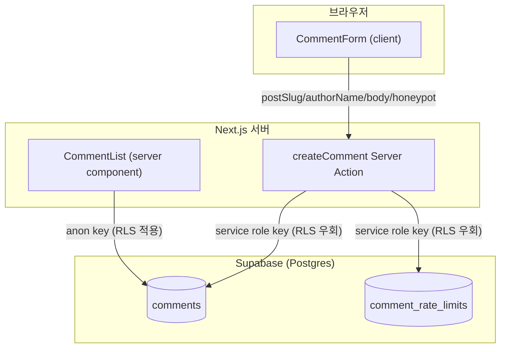
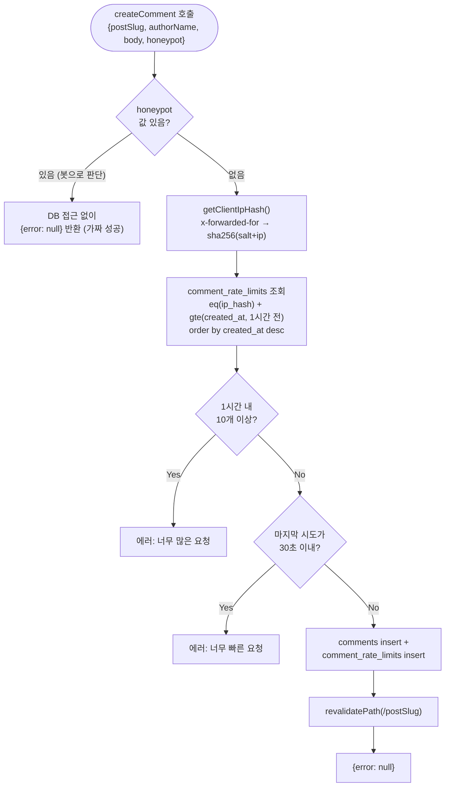

# 댓글 시스템 아키텍처

댓글 기능(등록·조회)과 Supabase 연동 구조, 그리고 봇 스팸 방지(rate limit + honeypot)를 어떻게 설계했는지 정리한 문서입니다. 왜 이런 구조가 됐는지의 히스토리(트러블슈팅 포함)는 대화 로그를 참고하고, 이 문서는 "지금 코드가 어떻게 짜여 있는가"에 집중합니다.

---

## 1. 전체 구조



핵심 설계 원칙: **읽기는 anon key, 쓰기는 service role key**로 완전히 분리했습니다. 처음엔 anon key 하나로 읽기·쓰기를 다 했었는데, anon key가 `NEXT_PUBLIC_*`로 클라이언트 번들에 노출되는 값이라 RLS 정책이 조금만 허술해도(`with check (true)`) 누구나 Supabase REST API를 직접 호출해 무제한으로 댓글을 꽂아넣을 수 있는 구멍이 됐습니다. 그래서 anon key의 쓰기 권한 자체를 없애고, 신뢰된 서버 코드(Server Action)만 쓸 수 있는 service role key로 쓰기 경로를 좁혔습니다.

---

## 2. DB 스키마 & 마이그레이션 히스토리

`supabase/migrations/`에 순서대로 적용되는 SQL 파일들 (Supabase CLI 연동 없이 대시보드 SQL Editor에 수동 실행하는 방식 — 파일명 번호는 실행 순서를 문서화하는 관례일 뿐, 도구가 강제하진 않음).

### `0001_init.sql` — 초기 테이블

```sql
create table public.comments (
  id uuid primary key default gen_random_uuid(),
  post_slug text not null,
  author_name text not null check (char_length(author_name) between 1 and 60),
  body text not null check (char_length(body) between 1 and 4000),
  created_at timestamptz not null default now()
);

grant select, insert on public.comments to anon, authenticated;
alter table public.comments enable row level security;

create policy "comments are publicly readable"
  on public.comments for select to anon, authenticated using (true);

create policy "anyone can insert a comment"   -- ← 이후 0002에서 제거됨
  on public.comments for insert to anon, authenticated with check (true);
```

`author_name`/`body`는 길이 제약(`check`)이 DB 레벨에 걸려 있어, 클라이언트의 `maxLength` 속성을 개발자도구로 우회해도 DB가 최종 방어선 역할을 합니다.

### `0002_restrict_comment_inserts.sql` — anon 쓰기 차단 + rate limit 테이블

```sql
drop policy "anyone can insert a comment" on public.comments;
revoke insert on public.comments from anon, authenticated;

create table public.comment_rate_limits (
  id bigint generated always as identity primary key,
  ip_hash text not null,
  created_at timestamptz not null default now()
);

create index comment_rate_limits_ip_hash_created_at_idx
  on public.comment_rate_limits (ip_hash, created_at);

alter table public.comment_rate_limits enable row level security;
```

`comment_rate_limits`는 RLS만 켜고 정책을 하나도 안 만들어서, anon/authenticated는 아무 것도 못 하고 service role(RLS를 우회)만 접근 가능합니다. `(ip_hash, created_at)` 복합 인덱스는 "이 IP가 최근 N분 안에 몇 번 시도했는지" 조회가 매 댓글 등록마다 실행되기 때문에 붙였습니다.

### `0003_grant_service_role.sql` — service role GRANT 보강

```sql
grant select, insert on public.comments to service_role;
grant select, insert on public.comment_rate_limits to service_role;
```

**트러블슈팅 기록**: `service_role`은 RLS(정책)는 우회하지만 **GRANT는 RLS와 별개로 여전히 필요**합니다. 이 프로젝트는 "Automatically expose new tables"를 꺼둔 설정이라 service_role에 대한 기본 권한도 자동으로 안 붙어서, 0002까지만 적용한 상태로 실제 댓글 등록을 시도하면 `permission denied for table comments` (Postgres 에러 코드 `42501`)로 전부 실패했습니다. delete 권한은 애플리케이션에 필요 없는 권한이라 의도적으로 안 줬습니다 (원칙: 필요한 최소 권한만 grant).

### `0007_cleanup_comment_rate_limits.sql` — 오래된 rate limit 기록 정리

```sql
create extension if not exists pg_cron with schema pg_catalog;

select cron.schedule(
  'cleanup-comment-rate-limits',
  '0 18 * * *',
  $$delete from public.comment_rate_limits where created_at < now() - interval '1 day'$$
);
```

`comment_rate_limits`는 댓글이 등록될 때마다 행이 쌓이기만 했습니다. rate limit 조회는 최근 1시간만 보므로(§5.3), Supabase **`pg_cron`** job이 매일 UTC 18:00(KST 03:00)에 1일 넘은 행을 지웁니다. 보관 기간 1일은 디버깅할 때 하루치 기록을 볼 수 있게 둔 여유분입니다.

- job은 이 SQL을 실행한 `postgres` 역할로 돌기 때문에, 0003의 "service_role에 delete 안 줌" 원칙은 그대로 유지됩니다.
- `cron.schedule`은 같은 이름이면 기존 job을 덮어쓰므로 다시 실행해도 job이 중복되지 않습니다.
- 등록 확인은 `select * from cron.job;`, 실행 기록은 `cron.job_run_details`에서 봅니다.
- `(ip_hash, created_at)` 인덱스는 `created_at` 단독 조건에는 거의 쓰이지 않지만, 하루치만 남는 작은 테이블을 하루 한 번 훑는 것이라 별도 인덱스는 두지 않았습니다.

### 권한 모델 요약

세 가지 레이어가 독립적으로 작동하고, 셋 다 통과해야 실제 접근이 됩니다.

| 레이어 | 하는 일 | anon | service_role |
|---|---|---|---|
| **GRANT** | "이 명령(select/insert/...)을 실행할 자격이 있는가" (테이블 단위, 거친 스위치) | insert 없음 (0002에서 회수) | select, insert만 (0003) |
| **RLS 활성화 여부** | 켜져 있으면 정책 없인 기본 전체 차단 | 켜짐 | 켜짐 |
| **RLS 정책 / BYPASSRLS** | "어떤 행까지 허용하는가" | `comments` select만 정책 있음 | RLS 자체를 **우회**(BYPASSRLS 속성) — 정책 무관하게 통과 |

---

## 3. Supabase 클라이언트 — 용도별로 2개 분리

| | `src/lib/supabase/client.ts` (`supabase`) | `src/lib/supabase/server-client.ts` (`supabaseAdmin`) |
|---|---|---|
| 키 | `NEXT_PUBLIC_SUPABASE_PUBLISHABLE_KEY` (anon) | `SUPABASE_SERVICE_ROLE_KEY` (service role) |
| 노출 범위 | 클라이언트 번들에 포함됨 (`NEXT_PUBLIC_*`) | 서버 전용, 브라우저로 절대 안 나감 |
| RLS | 그대로 적용 | 우회 |
| 쓰는 곳 | `CommentList` (댓글 조회) | `createComment` Server Action (rate limit 조회 + insert) |

`supabaseAdmin`은 `"use server"` 액션 밖(클라이언트 컴포넌트)에서 import하면 안 됩니다 — 그 순간 service role key가 번들에 노출되어 지금 만든 방어 구조가 전부 무의미해집니다.

---

## 4. 댓글 조회 — `CommentList`

```ts
// src/components/comments/comment-list.tsx (서버 컴포넌트)
const { data: comments } = await supabase
  .from("comments")
  .select("id, author_name, body, created_at")
  .eq("post_slug", postSlug)
  .order("created_at", { ascending: true });
```

anon key(`supabase`)로 조회하고, RLS의 "comments are publicly readable" 정책(`using (true)`)에 따라 해당 글(`post_slug`)의 댓글을 오래된 순으로 가져와 렌더링합니다. 서버 컴포넌트라 매 요청 시 서버에서 실행되고, 댓글 등록 후 `revalidatePath`로 갱신됩니다.

---

## 5. 댓글 등록 — `createComment` Server Action



파일: `src/lib/actions/comments.ts`

### 5.1 honeypot — 봇 감지

```ts
if (honeypot) return { error: null };
```

`CommentForm`의 화면에 안 보이는 `website` input에 값이 들어왔다면 사람이 아니라 자동 입력 봇으로 간주합니다. DB 조회/삽입을 아예 안 하고 성공한 것처럼 응답해서, 봇에게 "차단당했다"는 신호를 주지 않습니다.

### 5.2 IP 해시

```ts
const forwardedFor = headerList.get("x-forwarded-for"); // "client_ip, proxy_ip, ..." 형태
const ip = forwardedFor?.split(",")[0]?.trim() || realIp || "unknown";
const hash = sha256(`${salt}:${ip}`);
```

- 원본 IP를 그대로 저장하지 않고 salt를 섞은 해시만 저장 (DB 유출 시 원본 IP 역추적 방지 — salt 없이 `sha256(ip)`만 저장하면 IPv4 전체(43억 개)에 대한 레인보우 테이블로 역산 가능).
- `IP_HASH_SALT` 환경변수(권장, `.env.local`에만 존재·git 미포함)가 없으면 코드 내 fallback 상수 사용 — fallback은 소스에 그대로 보이므로 salt로서 보호 효과가 약함.
- 로컬 개발 환경(`next dev`, 프록시 없음)은 `x-forwarded-for`/`x-real-ip`가 둘 다 없어서 항상 `"unknown"`으로 fallback — 오히려 로컬 테스트 시 rate limit이 일관되게 걸려 테스트하기 편함. Vercel 배포 시엔 엣지 네트워크가 신뢰 가능한 형태로 채워줌.

### 5.3 rate limit — 이중 방어

| 규칙 | 상수 | 막는 대상 |
|---|---|---|
| 누적 총량 | `RATE_LIMIT_WINDOW_MS`(1시간) + `RATE_LIMIT_MAX_PER_WINDOW`(10) | 쿨다운을 지키며 느긋하게 도는 봇 |
| 연속 시도 간격(쿨다운) | `MIN_INTERVAL_MS`(30초) — 마지막 시도 시각과의 차이만 비교 | 짧은 시간에 연타하는 스크립트형 봇 |

조회 쿼리(`.eq("ip_hash", ...).gte("created_at", ...)`)가 `comment_rate_limits`의 `(ip_hash, created_at)` 복합 인덱스를 그대로 타도록 필터 순서를 맞춰뒀습니다 (동등 조건 먼저, 범위 조건 나중).

### 5.4 성공 시 기록

```ts
await supabaseAdmin.from("comments").insert({...});
await supabaseAdmin.from("comment_rate_limits").insert({ ip_hash: ipHash });
```

댓글 insert 성공 시마다 `comment_rate_limits`에도 시도 기록을 남겨야, 다음 요청이 왔을 때 rate limit 조회가 "최근에 몇 번 했는지"를 알 수 있습니다.

---

## 6. `CommentForm` — honeypot 필드

```tsx
<input
  type="text"
  name="website"
  value={website}
  onChange={(e) => setWebsite(e.target.value)}
  tabIndex={-1}
  autoComplete="off"
  aria-hidden="true"
  className="absolute left-[-9999px]"
/>
```

사람 눈엔 안 보이지만(화면 밖으로 배치) 폼을 자동으로 훑으며 채우는 봇에게는 노출되는 필드입니다. `display:none`/`type="hidden"`은 일부 봇이 걸러내고 건너뛰기 때문에, `absolute` 포지셔닝으로 화면 밖에 실제 렌더링된 `text` 타입 input을 써서 우회 난이도를 높였습니다. 제출 시 `website` 값이 `createComment`의 `honeypot` 파라미터로 전달됩니다.

---

## 7. 필요한 환경 변수

| 변수 | 필수 여부 | 노출 범위 | 용도 |
|---|---|---|---|
| `NEXT_PUBLIC_SUPABASE_URL` | 필수 | 공개 | 프로젝트 URL |
| `NEXT_PUBLIC_SUPABASE_PUBLISHABLE_KEY` | 필수 | 공개 | 댓글 조회(anon) |
| `SUPABASE_SERVICE_ROLE_KEY` | 필수 | **서버 전용, 비공개** | 댓글 등록/rate limit (service role) |
| `IP_HASH_SALT` | 권장(없어도 동작) | 서버 전용, 비공개 | IP 해시 salt — 없으면 코드 내 공개 fallback 사용 |

---

## 8. 알려진 한계 / 향후 고려사항

- **`x-forwarded-for` 신뢰 가정**: Vercel 같은 신뢰할 수 있는 엣지 네트워크를 통과한다는 전제 하에 안전함. 다른 호스팅으로 옮기면 이 헤더가 클라이언트에 의해 조작 가능한지 다시 확인 필요.
- **IP 기반 rate limit의 한계**: 같은 공유 IP(회사·통신사 NAT 등) 뒤 여러 사용자가 하나의 버킷을 공유할 수 있음 — 개인 블로그 규모에선 감수할 만한 트레이드오프로 판단.
- **`comment_rate_limits` 정리는 하루 1번**: `pg_cron`이 매일 1일 넘은 행을 지우므로(§2 `0007`) 테이블에는 최대 이틀 치 정도만 남음. 정리 주기 사이에 봇이 몰려도 행이 하루치만큼은 쌓일 수 있으나, rate limit 자체가 IP당 시간당 10건으로 막고 있어 감수할 만한 수준.
- **CAPTCHA 미도입**: honeypot + rate limit로 1차 방어만 구현. 더 정교한 봇에 계속 뚫리면 Cloudflare Turnstile 등 도입을 다음 단계로 검토.
