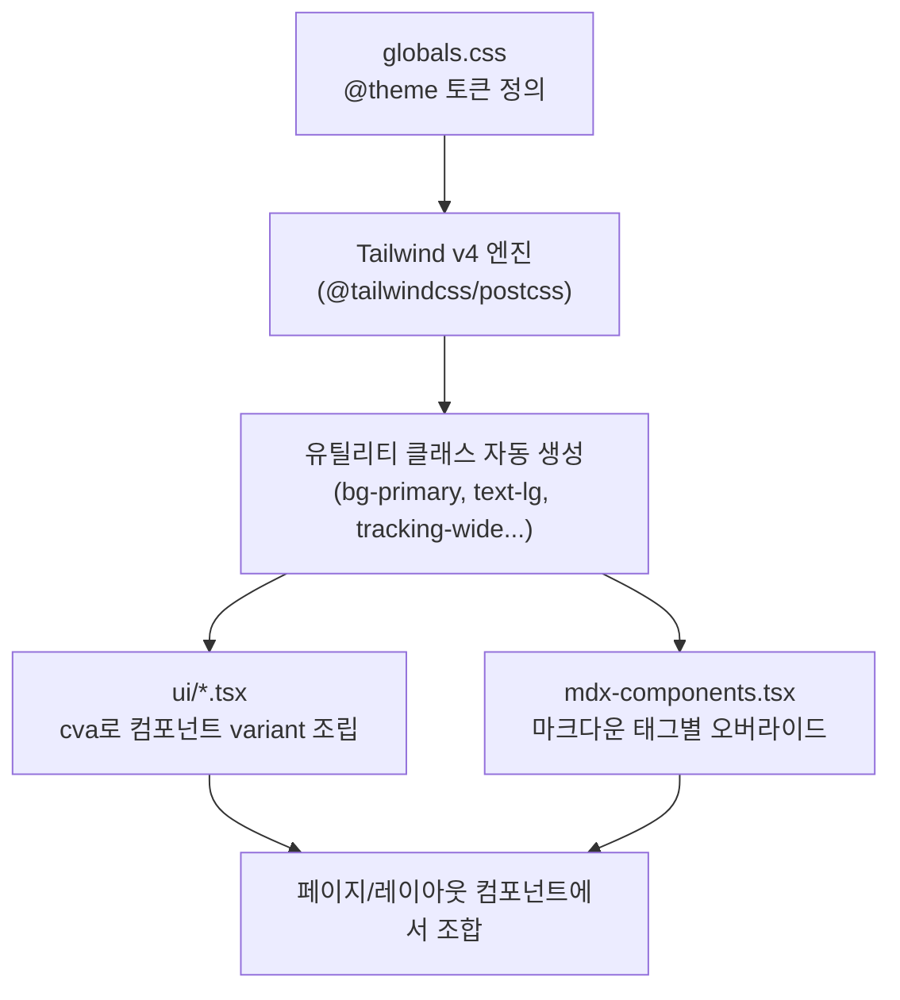
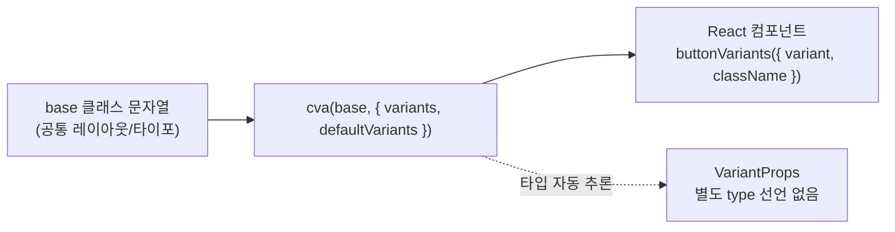
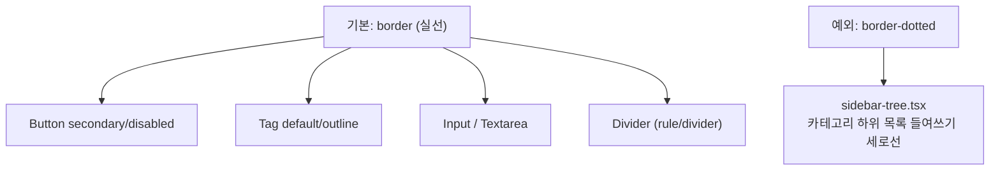
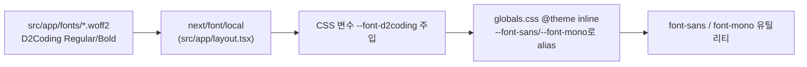
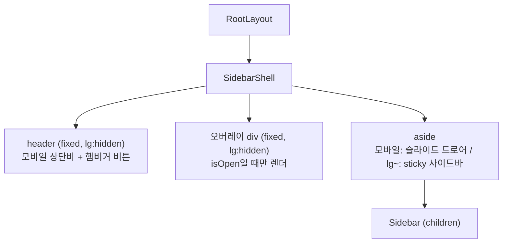

# CSS 아키텍처

이 블로그의 스타일 시스템이 어떤 레이어로 구성되어 있고, 각 레이어가 서로 어떻게 연결되는지 정리한 문서입니다. 토큰 값이 왜 그 값인지, 어떤 과정으로 확정됐는지의 히스토리는 [`design-concept.md`](./design-concept.md)를 참고하세요. 이 문서는 "지금 코드가 어떻게 짜여 있는가"에 집중합니다.

---

## 1. 전체 레이어 구조



- **토큰은 한 곳(`globals.css`)에만 정의**하고, 색상 값을 컴포넌트에 직접 하드코딩하지 않는다.
- Tailwind v4는 별도 `tailwind.config.js` 없이 CSS 파일 안의 `@theme` 블록만으로 유틸리티 스케일을 정의한다 (`postcss.config.mjs`는 `@tailwindcss/postcss` 플러그인 등록만 담당).

---

## 2. `globals.css` — 토큰 레이어

```
src/app/globals.css
├─ @import "tailwindcss"       Tailwind v4 엔진 로드
├─ @theme { ... }              디자인 토큰 정의 (색상 / 폰트크기 / line-height / letter-spacing)
├─ @theme inline { ... }       외부 CSS 변수(next/font가 주입) 참조 전용
└─ body / button,input... 리셋  전역 기본 스타일
```

### 2.1 `@theme` — 자체 정의 토큰

`--color-*`, `--text-*`, `--leading-*`, `--tracking-*` 네임스페이스로 값을 선언하면 Tailwind가 `bg-primary`, `text-lg`, `leading-relaxed`, `tracking-wide` 같은 유틸리티 클래스를 **자동으로** 만들어준다. 별도 config 파일에 매핑을 적어줄 필요가 없다.

- **색상 15개**: `background` / `surface` / `foreground` / `foreground-secondary` / `muted` / `subtle` / `border` / `border-muted` / `primary` / `accent-alt` / `code-bg` / `code-border` / `code-tab` / `code-text` / `disabled-bg`. 다크모드 전환 계획이 없어서 `:root` 레이어 없이 `@theme`에 hex 값을 직접 정의한다 (2단 참조를 안 두는 이유는 [`design-concept.md` 13번 항목](./design-concept.md) 참고).
- **font-size 11단계**(`--text-2xs` ~ `--text-5xl`): Tailwind 기본 스케일을 아트보드 실측값으로 전부 덮어씀.
- **각 크기별 기본 `line-height`**를 `--text-*--line-height`로 미리 짝지어놔서, `leading-*` 유틸을 따로 안 붙여도 크기에 맞는 줄간격이 자동 적용된다. `leading-*`를 명시적으로 붙이면 그쪽이 우선한다.
- **line-height 3단계**(`tight`/`normal`/`relaxed`), **letter-spacing 5단계**(`tight`/`snug`/`normal`/`wide`/`label`)도 같은 방식으로 재정의.
- **spacing은 별도 토큰 없음** — 실측값이 전부 4px 배수라 Tailwind v4 기본 유동 스케일(`p-15` = 60px 등)이 그대로 커버. 2px/3px/9px 같은 미세값만 컴포넌트에서 임의값(`pt-[2px]`)으로 처리한다.

### 2.2 `@theme inline` — 외부 변수 연결 전용

```css
@theme inline {
  --font-sans: var(--font-d2coding);
  --font-mono: var(--font-d2coding);
}
```

`next/font/local`(`src/app/layout.tsx`)이 런타임에 주입하는 `--font-d2coding` 변수를 그대로 참조만 한다. 값을 복제하는 별도 변수를 만들지 않기 위해 이 토큰만 예외적으로 `@theme`(non-inline) 대신 `@theme inline`에 둔다.

### 2.3 전역 리셋

- `body`에 `background`/`color` 기본값 적용.
- `button, input, textarea, select`의 브라우저 기본 `border-radius`를 `0`으로 리셋 — 사이트 전체 규칙이 "각진 모서리"이기 때문.

---

## 3. 컴포넌트 레이어 — `cva` 기반 variant 패턴

`src/components/ui/*` 아래 베이스 컴포넌트는 전부 같은 패턴을 따른다.



- 클래스를 문자열 변수(`Record<Variant, string>`)로 관리하지 않고 `class-variance-authority`(cva)를 쓰는 이유: 에디터의 Tailwind IntelliSense가 `cva()` 호출 안 문자열은 인식하지만 일반 객체 리터럴 문자열은 인식하지 못하기 때문 (`.zed/settings.json`의 `classFunctions: ["cva", "cx"]` 설정과 짝을 이룸).
- variant 타입은 별도 `type ButtonVariant`를 선언하지 않고 `VariantProps<typeof buttonVariants>`로 cva 설정 객체에서 자동 추론한다 — **cva 설정이 스타일과 타입의 단일 소스**.
- `className` prop은 항상 `xxxVariants({ variant, className })`의 두 번째 인자로 합류시켜 호출부에서 덮어쓸 수 있게 한다.

현재 존재하는 베이스 컴포넌트:

| 컴포넌트 | variant | 비고 |
|---|---|---|
| `Button` | `primary` / `secondary` / `text` / `disabled` | `disabled` variant 선택 시 `disabled` 속성 자동 부여 |
| `Tag` | `default` / `outline` / `filled` | |
| `Input` | (variant 없음, cva는 클래스 조합용으로만 사용) | `forwardRef`로 실제 `<input>` 노출 → `react-hook-form`의 `register()`와 연동. `aria-invalid="true"`면 테두리 `accent-alt` |
| `Textarea` | (variant 없음) | `Input`과 같은 스펙 + `resize-y`(세로만 크기 조절)·`leading-relaxed`. `forwardRef`·`aria-invalid` 처리도 `Input`과 동일 |
| `Divider` | `rule`(2px) / `divider`(1px, 기본) / `dotted` | `<hr>` 기반, `role="separator"` 접근성 확보 |

입력 요소의 에러 테두리는 `aria-[invalid=true]:border-accent-alt`로 건다. Tailwind 기본 `aria-*` 변형에 `invalid`가 없어서 임의 값 문법을 쓴다. 호출부는 `aria-invalid={!!errors.필드}`만 넘기면 시각 표시와 스크린리더 표시가 같이 붙는다.

`ui/` 폴더 원칙: **진짜 베이스 공통 컴포넌트만** 둔다. 데모/검증 목적 코드(예: react-hook-form 연동 테스트)는 `src/components/test/`로 분리한다.

---

## 4. 실선 기본 + 점선 예외 규칙

사이트 전체 테두리/구분선은 **실선이 기본**이고, 점선은 딱 한 군데 예외로만 존재한다.



`Divider`의 `dotted` variant는 표·인라인 보조 구분용으로 별도 존재하지만, 실제로 점선이 쓰이는 유일한 실사용처는 `src/components/layout/sidebar-tree.tsx`의 트리 가이드라인(`border-l border-dotted border-border`)이다.

---

## 5. MDX 콘텐츠 스타일링 — `mdx-components.tsx`

`.mdx` 파일 본문의 마크다운 요소는 Tailwind 클래스가 자동으로 붙지 않으므로, `src/mdx-components.tsx`에서 태그별로 직접 오버라이드한다.


- 타이포그래피 오버라이드(`h1`~`h3`, `p`, `a`, `ul`/`ol`/`li`, `strong`, `blockquote`)는 반응형(`md:text-lg` 등)과 토큰(`text-foreground-secondary` 등)을 직접 조합해서 적용 — 별도 `@tailwindcss/typography` 플러그인은 쓰지 않기로 확정했다.
- `hr`은 새로 스타일을 짜지 않고 기존 `Divider`(`divider` variant)를 재사용한다 — 마크다운 요소라도 이미 있는 베이스 컴포넌트를 우선한다.
- **코드블록은 전용 `ui/code-block.tsx` 컴포넌트가 없다.** 대신 `next.config.ts`의 `rehype-pretty-code`가 코드펜스마다 뱉는 `<figure><figcaption>파일명</figcaption><pre><code>...</code></pre></figure>` 구조에 `figure`/`figcaption`/`pre` 오버라이드로 `code-bg`/`code-border`/`code-tab`/`code-text` 토큰을 입힌다. `keepBackground: false`로 Shiki 테마의 배경색을 끄고 우리 토큰이 배경을 직접 제어한다.
- 각 오버라이드는 `className={...${className ?? ""}}` 형태로 MDX가 넘기는 className을 항상 뒤에 이어 붙여, 특정 코드펜스에서 개별 스타일을 얹을 여지를 남긴다.

---

## 6. 폰트 파이프라인



Google Fonts에 없는 폰트라 `src/app/fonts/`에 woff2 파일을 자체 호스팅하고 `next/font/local`로 로드한다. 한글·영문·코드 전부 한 폰트(D2Coding)로 통일하기 위해 `font-sans`/`font-mono` 두 유틸리티가 같은 변수를 가리킨다.

---

## 7. 반응형 사이드바 레이아웃 — `sidebar-shell.tsx`

`Sidebar`(콘텐츠: 로고 + 카테고리 트리)는 항상 같은 컴포넌트지만, 이를 감싸는 `SidebarShell`이 뷰포트 크기에 따라 완전히 다른 배치 전략을 쓴다.



### 7.1 물리 속성 대신 논리 속성(logical properties)

Tailwind v4는 `inset-x-*` 계열을 `left`/`right`가 아니라 **논리 속성**으로 컴파일한다.

| Tailwind 클래스 | 실제 CSS |
|---|---|
| `inset-x-0` | `inset-inline: 0px` (= `inset-inline-start`/`-end` 동시에 0) |
| `inset-0` | `inset: 0px` (상하좌우 전부 0) |

`inset-inline`은 텍스트 진행 방향(LTR/RTL) 기준 "시작~끝"이라, `left`/`right`를 직접 쓰는 것보다 방향에 안전하다. 이 프로젝트는 LTR 고정이라 체감 차이는 없지만, Tailwind v4의 기본 산출물이 그렇다는 점만 알아두면 된다.

### 7.2 요소별 포지셔닝

| 요소 | 클래스 (모바일 기준) | 의미 |
|---|---|---|
| `header` | `fixed inset-x-0 top-0 z-50 h-14` | 뷰포트 최상단에 폭 100%로 고정된 얇은 바 |
| 오버레이 `div` | `fixed inset-0 z-30 bg-black/40` | 뷰포트 전체를 덮는 반투명 딤 배경, `isOpen`일 때만 렌더 |
| `aside` | `fixed top-14 bottom-0 left-0 z-40 w-65` + `-translate-x-full`/`translate-x-0` | 헤더 바로 아래부터 화면 하단까지, 왼쪽에서 슬라이드 인/아웃되는 드로어 |

**쌓임 순서(z-index)**: `header(50) > aside(40) > 오버레이(30) > 본문`. 항상 보여야 하는 상단바가 가장 위, 그 아래 드로어 메뉴, 그 아래 배경 딤 처리, 맨 아래 원래 페이지 콘텐츠 순.

`aside`는 `translate-x` 트랜지션으로 열고 닫는다 — `isOpen`이 `false`면 `-translate-x-full`(왼쪽 화면 밖으로 이동), `true`면 `translate-x-0`(제자리)으로 `duration-200` 애니메이션.

### 7.3 `lg:` 이상에서는 다른 레이아웃으로 전환

같은 마크업이 `lg` 브레이크포인트부터는 클래스 오버라이드로 데스크톱 사이드바가 된다.

- `header`, 오버레이: `lg:hidden` — 데스크톱에서는 아예 렌더 트리에서 안 보임 (오버레이는 `isOpen` 상태와 무관하게 CSS로 숨김)
- `aside`: `lg:sticky lg:top-0 lg:bottom-auto lg:left-auto lg:h-screen lg:translate-x-0` — `fixed` 드로어에서 `sticky` 사이드바로 전환, 트랜지션용 `translate-x`도 무효화되어 항상 제자리
- `RootLayout`(`src/app/layout.tsx`)의 `{children}` 래퍼에 붙은 `pt-14 lg:pt-0`도 같은 이유: 모바일에서는 `fixed` 헤더가 차지하는 높이(`h-14`)만큼 본문을 밀어줘야 하지만, 데스크톱은 헤더 자체가 없으므로 여백도 필요 없다.

즉 "모바일 전용 헤더+드로어" 세트와 "데스크톱 전용 sticky 사이드바"가 하나의 `aside` 엘리먼트 위에서 Tailwind 반응형 프리픽스만으로 전환되는 구조다.

---

## 8. 새 컴포넌트를 추가할 때 따라야 할 순서

1. 색상·크기·간격이 필요하면 먼저 `globals.css`의 기존 토큰(`--color-*`/`--text-*`/`--leading-*`/`--tracking-*`)에서 찾는다. 없는 값을 새로 하드코딩하기 전에 정말 새 토큰이 필요한지 확인한다.
2. 여러 상태(variant)가 있는 컴포넌트면 `cva`로 작성하고 `VariantProps`로 타입을 추론시킨다 (§3).
3. 테두리는 기본이 실선이다. 점선을 쓰려는 경우 §4의 예외 규칙에 해당하는지 먼저 확인한다.
4. 마크다운 본문에서만 쓰이는 요소면 `ui/`에 새 컴포넌트를 만들기 전에 `mdx-components.tsx` 오버라이드로 충분한지 먼저 검토한다.
5. 데모/테스트 목적 코드는 `ui/`가 아니라 `src/components/test/`에 둔다.
