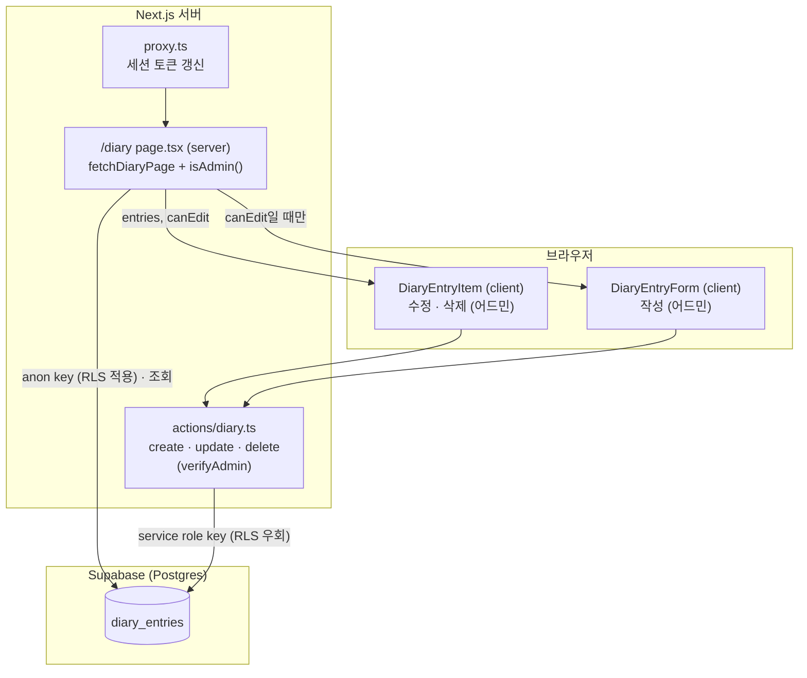

# 짧은 일기 아키텍처

`/diary` 페이지(짧은 일기 목록 · 페이지네이션 · 어드민 작성/수정/삭제)가 지금 어떻게 짜여 있는지 정리한 문서입니다. 작업 경위는 [`design-concept.md`](./design-concept.md) 39번 로그 참고. 처음 이름은 "한줄 일기"였고 2026-10-04에 "짧은 일기"로 바꿨습니다.

---

## 1. 전체 구조



**읽기는 anon key, 쓰기는 service role key** — 댓글·카테고리와 같은 원칙입니다. 어드민 판별은 서버 코드(`src/lib/dal.ts`)에서만 합니다.

| 파일 | 종류 | 역할 |
|---|---|---|
| `supabase/migrations/0009_diary_entries.sql` | SQL | 테이블 · 인덱스 · GRANT · RLS |
| `src/lib/diary.ts` | 공용 | `fetchDiaryPage`, `parsePageParam`, `DIARY_PAGE_SIZE`(5), `DIARY_BODY_MAX_LENGTH`(1000) |
| `src/lib/actions/diary.ts` | Server Action | `createDiaryEntry` / `updateDiaryEntry` / `deleteDiaryEntry` |
| `src/app/diary/page.tsx` | 서버 컴포넌트 | 조회, 페이지 번호 보정(redirect), 어드민 여부에 따라 UI 분기 |
| `src/components/diary/diary-entry-item.tsx` | 클라이언트 | 항목 하나 + 어드민 수정/삭제 모드 |
| `src/components/diary/diary-entry-form.tsx` | 클라이언트 | 하단 작성 폼 (RHF) |
| `src/components/diary/diary-pagination.tsx` | 서버 컴포넌트 | `← 이전  1 … 4 5 6 … 20  다음 →` |
| `src/components/layout/sidebar-tree.tsx` | 클라이언트 | 트리 맨 아래 "짧은 일기" 항목 (`DIARY_LINK`) |

---

## 2. DB — `0009_diary_entries.sql`

```sql
create table public.diary_entries (
  id uuid primary key default gen_random_uuid(),
  body text not null check (char_length(body) between 1 and 1000),
  created_at timestamptz not null default now()
);
create index diary_entries_created_at_id_idx on public.diary_entries (created_at, id);

grant select on public.diary_entries to anon, authenticated;
grant select, insert, update, delete on public.diary_entries to service_role;
alter table public.diary_entries enable row level security;
create policy "diary entries are publicly readable" on public.diary_entries for select to anon, authenticated using (true);
```

- **댓글과 테이블을 나눈 이유**: 작성자 이름 · `ip_hash` · 글 slug가 필요 없고 쓰기 권한 규칙도 달라서, 한 테이블에 섞으면 RLS · 서버 액션에 분기가 생깁니다.
- **1000자**: 나만 쓰고 고치는 일기라 넉넉하게. `DIARY_BODY_MAX_LENGTH`와 같은 값.
- **`(created_at, id)` 인덱스**: 목록이 `created_at desc, id desc`로 정렬되므로, 같은 시각의 행이 있어도 순서가 하나로 정해져 페이지 경계에서 겹치거나 빠지지 않습니다.
- **`updated_at` 없음**: "수정됨" 표시 계획이 없어서. 필요해지면 컬럼 추가 마이그레이션.
- 권한 확인 쿼리에서 `postgres`에 모든 권한이 보이는 건 SQL Editor로 만든 테이블의 **소유자**라서 — API 요청은 `postgres` 역할로 실행될 수 없으므로 정상입니다.

---

## 3. 조회 — 페이지 번호 방식

`/diary?page=N`, 한 페이지 5개, 최신순(1페이지 = 가장 최근 5개).

### 3.1 `fetchDiaryPage(requestedPage)` — 개수 먼저, 그다음 범위

```ts
const { count } = await supabase.from("diary_entries").select("id", { count: "exact", head: true });
const totalPages = Math.ceil(count / DIARY_PAGE_SIZE);
const page = Math.min(requestedPage, totalPages);
// page 3 → from 10, to 14
await supabase.from("diary_entries").select("id, body, created_at")
  .order("created_at", { ascending: false }).order("id", { ascending: false })
  .range(from, to);
```

- **offset(`.range`)을 쓴 이유**: 페이지 번호로 이동하려면 "N번째 페이지"라는 위치와 전체 페이지 수가 필요합니다. (댓글은 더보기라 커서 방식 — [`comments-architecture.md` §4](./comments-architecture.md))
- **개수를 먼저 세는 이유**: 마지막 페이지를 넘는 범위를 `.range()`로 요청하면 PostgREST가 416 에러를 돌려줍니다. 개수로 범위를 확정하고 그 안에서만 조회합니다.
- 일기가 0개면 조회 없이 `{ entries: [], page: 1, totalPages: 0 }`.

### 3.2 페이지 번호 보정 — `page.tsx`

| 요청 | 처리 |
|---|---|
| `?page=abc`, `?page=0`, 없음 | `parsePageParam` → 1페이지 |
| `?page=9` (마지막이 2) | `fetchDiaryPage`가 2로 맞춤 → `redirect("/diary?page=2")` |
| 마지막 페이지의 마지막 항목 삭제 | 삭제 액션의 `revalidatePath`로 다시 그릴 때 위와 같은 redirect |

`redirect()`는 예외를 던져 렌더링을 끝내므로 조회 `try/catch` **밖**에서 호출합니다 (안에 두면 `catch`가 삼킴).

### 3.3 페이지 이동 UI — `diary-pagination.tsx`

- 처음 · 끝 페이지는 항상, 현재 페이지 앞뒤 2개(`SIBLING_COUNT`)만 펼치고 나머지는 `…` — 5개씩이면 1년에 70페이지를 넘을 수 있어서.
  - 20페이지 중 5페이지: `1 … 3 4 5 6 7 … 20`
- 1페이지 링크는 `?page=1`이 아니라 `/diary` (같은 페이지가 주소 두 개로 나뉘지 않게).
- 현재 페이지는 실선 테두리 + `aria-current="page"`. 첫/마지막 페이지의 이전/다음은 링크 없는 흐린 글자. 페이지가 1개 이하면 렌더링하지 않음.

### 3.4 렌더링 방식

`?page=`(searchParams)와 세션(`isAdmin()`)을 읽어서 **요청마다 렌더링**되는 동적 페이지입니다. 블로그 글(`/[slug]`) · 홈(`/`)은 여전히 정적.

---

## 4. 어드민 UI 분기 — `isAdmin()`

```ts
// page.tsx
const canEdit = await isAdmin();
<DiaryEntryItem entry={entry} canEdit={canEdit} />
{canEdit && <DiaryEntryForm />}
```

- `isAdmin()`(`src/lib/dal.ts`)은 `verifyAdmin()`과 같은 판별 규칙(`isAdminUser`)을 쓰지만 403으로 막지 않고 true/false만 돌려줍니다 — 공개 페이지라 일반 방문자도 봐야 하므로.
- **화면에서 숨기는 것일 뿐 방어선이 아닙니다.** 서버 액션은 직접 호출될 수 있으므로 세 액션 모두 맨 앞에서 `verifyAdmin()`을 다시 호출합니다.
- **`proxy.ts` matcher에 `/diary` 포함**: 서버 컴포넌트는 쿠키를 쓸 수 없어서, 만료된 access token을 `isAdmin()`이 갱신만 하고 저장하지 못하면 이미 쓴 refresh token이 재사용돼 로그인이 풀릴 수 있습니다. proxy가 먼저 갱신해 새 쿠키를 응답에 싣습니다 ([`auth-architecture.md` §5](./auth-architecture.md)).

---

## 5. 쓰기 — Server Action (`src/lib/actions/diary.ts`)

| 액션 | 순서 |
|---|---|
| `createDiaryEntry({ body })` | `verifyAdmin()` → trim → `validateBody` → insert → `revalidatePath("/diary")` |
| `updateDiaryEntry({ id, body })` | `verifyAdmin()` → trim → `validateBody` → **본문만** update (`created_at` 유지) → `revalidatePath` |
| `deleteDiaryEntry({ id })` | `verifyAdmin()` → delete → `revalidatePath` |

- `validateBody`(작성 · 수정 공통): 공백을 자른 뒤 빈 값이면 "내용을 입력해 주세요.", 1000자 초과면 거부. DB `check`는 길이만 봐서 공백만 있는 값을 통과시키므로 서버에서 막습니다.
- update/delete는 `.select("id")`로 실제로 바뀐 행을 돌려받아, **0행이면 "이미 삭제된 일기입니다."** — 탭 두 개에서 한쪽이 먼저 지운 경우 조용히 성공한 것처럼 보이지 않게.
- DB 에러 원인은 `console.error`로 서버 로그에만 남기고 화면엔 일반 문구 (카테고리 액션과 같은 방식).

---

## 6. 클라이언트 컴포넌트

### 6.1 `DiaryEntryForm` — 하단 작성 폼

- 댓글 폼과 같은 패턴: RHF `register` + `required` · 공백만 입력 차단(`validate`) · `maxLength` 1000, 서버 에러는 `setError("root.serverError")`, 제출 중 상태는 RHF `isSubmitting`이 아니라 `useTransition` (Server Action은 `startTransition`으로 감싸 호출 — [`comments-architecture.md` §6](./comments-architecture.md)).
- 저장 성공 시 `reset()` 후 `router.push("/diary")` — 최신순이라 새 일기는 1페이지 맨 위에 들어가므로, 다른 페이지에서 썼어도 바로 보이게.

### 6.2 `DiaryEntryItem` — 항목 + 수정/삭제

| mode | 화면 |
|---|---|
| `view` | 날짜 · 본문, 오른쪽 위 `수정` `삭제` (canEdit일 때) |
| `edit` | 본문 자리에 Textarea(RHF) + `[저장]` `[취소]` |
| `confirmDelete` | 오른쪽 위가 `정말 삭제할까요? 확인 취소` — 브라우저 `confirm()` 대신 그 자리 두 단계 확인 |

- 수정을 열 때마다 `reset({ body: entry.body })` — 취소했다가 다시 열어도 저장된 내용부터.
- 저장 · 삭제 성공 후엔 `revalidatePath`로 새 목록이 prop으로 내려오므로 모드만 `view`로 되돌립니다.
- 날짜는 `toLocaleDateString("ko-KR", { timeZone: "Asia/Seoul" })` — 서버(Vercel은 UTC)와 브라우저의 렌더링 결과가 같아져 hydration 불일치가 없습니다.
- 작은 버튼(`SmallButton`)은 `ui/Button`의 `text` variant + `className="px-2 py-1 text-xs …"` — Button 안의 `cn()`이 겹치는 기본 클래스(`px-4 py-2 text-sm text-foreground`)를 지운다 ([`css-architecture.md` §3.1](./css-architecture.md)). 비활성일 땐 `disabled` variant(회색 박스) 대신 `disabled:text-code-tab`으로 글자만 흐리게.

---

## 7. 사이드바 항목

```tsx
const DIARY_LINK: SidebarPost = { slug: "diary", title: "짧은 일기" };
<PostList posts={[DIARY_LINK]} activeSlug={activeSlug} />   // 트리 맨 아래
```

글과 같은 `SidebarPost` 형태로 넘겨 기존 `PostList`의 파일 아이콘 · 활성 표시를 그대로 씁니다. `/diary?page=2`에서도 `usePathname()`은 `"/diary"`라 활성 상태가 유지됩니다.

---

## 8. 알려진 한계 / 주의

- **`diary` slug 예약**: `/diary`는 정적 경로라 `/[slug]`보다 먼저 매칭됩니다. slug가 `diary`인 MDX 글은 만들 수 없습니다.
- **offset 페이지네이션의 경계 이동**: 다른 사람이 읽는 중에 어드민이 새 일기를 쓰면 다음 페이지로 넘어갈 때 항목 하나가 겹쳐 보일 수 있습니다. 작성자가 한 명이라 감수.
- **수정 이력 없음**: 본문을 덮어쓰고 이전 내용은 남지 않습니다.